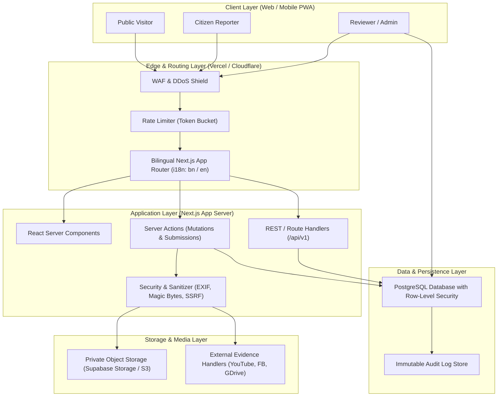
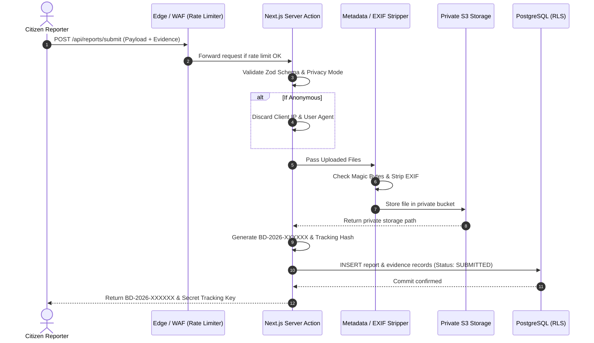

# SYSTEM ARCHITECTURE SPECIFICATION

---

## 1. Architectural Philosophy & Principles

The Bangladesh Civic Reporting Platform is architected around six core tenets:
1. **Zero Trust for Client Requests:** All validation, authorization, and sanitization occur server-side.
2. **Defamation & Legal Shield by Design:** Every case record is strictly classified as an *allegation* until verified via a standardized evidentiary process.
3. **Data Minimization:** Only data strictly necessary for investigating an incident is captured. Anonymous reports discard IP addresses, EXIF metadata, and user-agent fingerprints.
4. **Resilient Evidence Architecture:** Prioritize client-safe external embeds (YouTube, Facebook, Google Drive) alongside encrypted object storage to balance server costs, storage limits, and verifiable preservation.
5. **Role-Based Segregation (RBAC & RLS):** Strict isolation between unauthenticated public views, tracking token sessions, reviewer queues, and administrative audit panels.
6. **Bilingual Parity:** First-class internationalization (Bangla `bn` and English `en`) at both UI and database levels.

---

## 2. High-Level System Architecture Diagram

---

## 3. Technology Stack Specification

| Component | Choice | Version / Standard | Justification |
| :--- | :--- | :--- | :--- |
| **Frontend & Framework** | Next.js (App Router) | 14.x / 15.x | Server Components minimize client bundle size, Server Actions eliminate exposed boilerplate API routes, native i18n support. |
| **Language** | TypeScript | 5.x Strict | Guarantees type safety across report models, tracking codes, and access permissions. |
| **Styling & Design System** | Tailwind CSS + Radix UI | Tailwind 3.4+ / Radix | High accessibility (ARIA), headless flexibility, lightweight, mobile-first responsive utilities. |
| **Iconography** | Lucide React | Latest | Clean, consistent, lightweight SVG icons. |
| **Database** | PostgreSQL | 15+ | Relational integrity, JSONB support for external evidence metadata, built-in Row-Level Security (RLS). |
| **Database Client / ORM** | Supabase JS / Drizzle ORM | Latest | Native support for Row-Level Security, connection pooling, and real-time subscription capabilities. |
| **Internationalization** | `next-intl` | Latest | Type-safe dictionary messages, route-based locale handling (`/bn/report`, `/en/report`), SEO-friendly alternate hreflang. |
| **Validation** | Zod | 3.x | End-to-end schema validation shared between client forms and server actions. |
| **Map Rendering** | Leaflet + React-Leaflet | 4.x | Lightweight, zero-vendor-lockin mapping with custom GeoJSON polygons for Bangladesh divisions/districts. |
| **Charts** | Recharts | 2.x | Accessible SVG rendering for public accountability metrics. |
| **Object Storage** | Supabase Storage / S3 | S3 API Compliant | Private buckets with short-lived presigned download URLs. |

---

## 4. Core Architectural Domains

### 4.1 Reporting & Tracking Domain
- **Multi-Step State Flow:** Incident details, location classification (Division, District, Upazila/Thana), actor specification, and evidence attachment.
- **Privacy Engine:**
  - *Anonymous:* No user ID, no IP address recorded, EXIF removed.
  - *Confidential:* Reporter contact securely encrypted; accessible only to Senior Reviewers.
  - *Identified:* Name/organization visible to authorized parties as permitted.
- **Tracking Credential Architecture:**
  - Public identifier format: `BD-YYYY-NNNNNN` (e.g., `BD-2026-001241`).
  - Secret tracking token: Cryptographically secure 16-character alphanumeric key (e.g., `k9f2-8mpx-4v7q-z1yt`), stored using **Argon2id/Bcrypt** hash in the database.
  - Verification: Citizens enter both public ID and secret token to access the private tracking panel.

### 4.2 Evidence Subsystem Domain
- **Direct File Storage:**
  - MIME-type inspection via file magic bytes (headers) on server intake.
  - Configurable file ceilings: Images (10MB), Documents (20MB), Audio (30MB), Video (100MB).
  - Storage paths randomized: `cases/{report_uuid}/{uuid_v4}.{ext}`.
- **External Evidence Integrations (First-Class Feature):**
  - **YouTube:** Safe parser extracting video IDs for sandboxed `iframe` rendering.
  - **Facebook:** Sandboxed public post embeds or fallback links with integrity warnings.
  - **Google Drive / Google Photos / Dropbox:** Embed preview for permitted public view links or direct external redirect cards.
  - **SSRF Defense:** External links checked server-side through a strict URL allowlist and private IP filter.

### 4.3 Moderation & Review Domain
- **Workflow State Machine:**
  - `SUBMITTED` → `RECEIVED` → `UNDER_REVIEW` → `MORE_INFO_REQUIRED` / `EVIDENCE_REVIEW` → `REVIEWED` → `REFERRED` / `VERIFIED` / `UNSUBSTANTIATED` → `RESOLVED` / `CLOSED`.
- **Reviewer Queues:** Reports are sorted by priority, category, and submission timestamp.
- **Internal Audit Trails:** All reviewer notes and status modifications are written to `audit_logs` with the actor's UUID and timestamp.

### 4.4 Public Accountability & Directory Domain
- **Aggregated Map Panel:** Aggregates reports by Bangladesh's 8 Divisions (Dhaka, Chittagong, Rajshahi, Khulna, Barishal, Sylhet, Rangpur, Mymensingh) and 64 Districts. Exact coordinates of sensitive incidents are strictly obscured.
- **Public Report Catalog:** Only cases approved with `is_public = true` by a Senior Reviewer are rendered.
- **Organization Directory:** Verified profile pages for educational institutions, government bodies, and law enforcement departments showcasing incident trends and official responses.

---

## 5. Security & Privacy Topology

---

## 6. Bilingual i18n Strategy

- Route pattern: `/[locale]/...` where `locale` is either `bn` (Bengali) or `en` (English).
- Cookie fallback `NEXT_LOCALE` preserves user selection across sessions.
- All dictionary keys are organized functionally:
  - `common.*` (Buttons, navigation, footers, status labels)
  - `wizard.*` (Multi-step form prompts, input labels, tooltips)
  - `categories.*` (Hierarchical category titles and descriptions)
  - `evidence.*` (Upload errors, provider warnings, embed notices)
  - `track.*` (Case status badges, timeline descriptions)
  - `methodology.*` (Verification guidelines and legal disclaimers)
