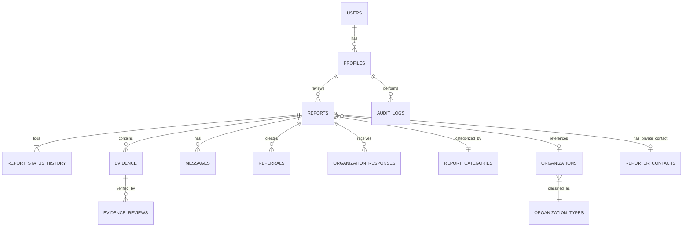

# DATABASE ARCHITECTURE & SCHEMA SPECIFICATION

---

## 1. Relational Database Overview

The platform uses **PostgreSQL 15+** (via Supabase) with **Row-Level Security (RLS)** strictly enforced on all tables. 

### Design Principles:
- **Zero Raw Tracking Secrets:** Tracking credentials use salted cryptographic hashes (`Argon2id` or `Bcrypt`).
- **Data Isolation:** Reporter contacts for confidential reports are stored in an encrypted table (`reporter_contacts`) separate from public report summaries.
- **Strict Audit Immutability:** `audit_logs` and `report_status_history` are append-only; update/delete operations are disabled via database triggers.
- **Relational Integrity:** Foreign keys use strict constraints (`ON DELETE RESTRICT` or `ON DELETE CASCADE` where appropriate).

---

## 2. Entity Relationship Diagram (ERD)



---

## 3. PostgreSQL DDL & Table Definitions

```sql
-- ============================================================================
-- ENUM TYPES
-- ============================================================================

CREATE TYPE user_role_enum AS ENUM (
    'public_visitor',
    'reporter',
    'reviewer',
    'senior_reviewer',
    'admin'
);

CREATE TYPE privacy_mode_enum AS ENUM (
    'anonymous',
    'confidential',
    'identified'
);

CREATE TYPE location_privacy_enum AS ENUM (
    'exact',
    'approximate',
    'confidential'
);

CREATE TYPE report_status_enum AS ENUM (
    'submitted',
    'received',
    'under_review',
    'more_info_required',
    'evidence_review',
    'reviewed',
    'referred',
    'verified',
    'unsubstantiated',
    'resolved',
    'closed'
);

CREATE TYPE evidence_type_enum AS ENUM (
    'image',
    'video',
    'audio',
    'document',
    'external_link'
);

CREATE TYPE evidence_provider_enum AS ENUM (
    'direct_upload',
    'youtube',
    'facebook',
    'google_drive',
    'google_photos',
    'dropbox',
    'external_web'
);

CREATE TYPE evidence_visibility_enum AS ENUM (
    'private',
    'reviewer_only',
    'public'
);

CREATE TYPE evidence_review_state_enum AS ENUM (
    'pending',
    'accessible',
    'reviewed',
    'accepted',
    'rejected',
    'unavailable'
);

-- ============================================================================
-- 1. PROFILES & RBAC
-- ============================================================================

CREATE TABLE profiles (
    id UUID PRIMARY KEY REFERENCES auth.users(id) ON DELETE CASCADE,
    email TEXT UNIQUE NOT NULL,
    full_name TEXT,
    role user_role_enum NOT NULL DEFAULT 'reviewer',
    is_active BOOLEAN NOT NULL DEFAULT true,
    created_at TIMESTAMPTZ NOT NULL DEFAULT timezone('utc', now()),
    updated_at TIMESTAMPTZ NOT NULL DEFAULT timezone('utc', now())
);

-- ============================================================================
-- 2. REPORT CATEGORIES & TAXONOMY
-- ============================================================================

CREATE TABLE report_categories (
    id UUID PRIMARY KEY DEFAULT gen_random_uuid(),
    code TEXT UNIQUE NOT NULL, -- e.g. 'abuse_harassment', 'corruption'
    name_en TEXT NOT NULL,
    name_bn TEXT NOT NULL,
    description_en TEXT,
    description_bn TEXT,
    parent_id UUID REFERENCES report_categories(id) ON DELETE SET NULL,
    display_order INT NOT NULL DEFAULT 0,
    is_active BOOLEAN NOT NULL DEFAULT true,
    created_at TIMESTAMPTZ NOT NULL DEFAULT timezone('utc', now())
);

-- ============================================================================
-- 3. ORGANIZATIONS & DIRECTORY
-- ============================================================================

CREATE TABLE organization_types (
    id UUID PRIMARY KEY DEFAULT gen_random_uuid(),
    name_en TEXT NOT NULL,
    name_bn TEXT NOT NULL,
    code TEXT UNIQUE NOT NULL -- 'university', 'police', 'government', etc.
);

CREATE TABLE organizations (
    id UUID PRIMARY KEY DEFAULT gen_random_uuid(),
    type_id UUID NOT NULL REFERENCES organization_types(id) ON DELETE RESTRICT,
    name_en TEXT NOT NULL,
    name_bn TEXT NOT NULL,
    slug TEXT UNIQUE NOT NULL,
    division TEXT NOT NULL,
    district TEXT NOT NULL,
    address TEXT,
    contact_email TEXT,
    is_verified BOOLEAN NOT NULL DEFAULT false,
    created_at TIMESTAMPTZ NOT NULL DEFAULT timezone('utc', now()),
    updated_at TIMESTAMPTZ NOT NULL DEFAULT timezone('utc', now())
);

-- ============================================================================
-- 4. CORE INCIDENT REPORTS
-- ============================================================================

CREATE TABLE reports (
    id UUID PRIMARY KEY DEFAULT gen_random_uuid(),
    report_number TEXT UNIQUE NOT NULL, -- Format: 'BD-2026-XXXXXX'
    tracking_hash TEXT NOT NULL,        -- Argon2id/Bcrypt hash of tracking secret
    category_id UUID NOT NULL REFERENCES report_categories(id) ON DELETE RESTRICT,
    privacy_mode privacy_mode_enum NOT NULL DEFAULT 'anonymous',
    
    -- Incident Details
    incident_date DATE NOT NULL,
    approximate_time TEXT,
    division TEXT NOT NULL,             -- Dhaka, Chittagong, Rajshahi, etc.
    district TEXT NOT NULL,             -- 64 Districts
    upazila_thana TEXT,
    area_landmark TEXT,
    location_privacy location_privacy_enum NOT NULL DEFAULT 'approximate',
    
    -- Entities Involved
    organization_id UUID REFERENCES organizations(id) ON DELETE SET NULL,
    custom_organization_name TEXT,
    institution_type TEXT,
    involved_role_or_title TEXT,
    
    -- Narrative
    description TEXT NOT NULL,
    public_summary TEXT,                -- Sanitized summary approved for public display
    
    -- Status & Moderation
    status report_status_enum NOT NULL DEFAULT 'submitted',
    priority INT NOT NULL DEFAULT 1,    -- 1: Normal, 2: High, 3: Urgent
    is_public BOOLEAN NOT NULL DEFAULT false,
    verified_status BOOLEAN NOT NULL DEFAULT false,
    
    -- Reviewer Assignments
    assigned_reviewer_id UUID REFERENCES profiles(id) ON DELETE SET NULL,
    assigned_senior_id UUID REFERENCES profiles(id) ON DELETE SET NULL,
    
    -- Timestamps
    created_at TIMESTAMPTZ NOT NULL DEFAULT timezone('utc', now()),
    updated_at TIMESTAMPTZ NOT NULL DEFAULT timezone('utc', now())
);

CREATE INDEX idx_reports_report_number ON reports(report_number);
CREATE INDEX idx_reports_status ON reports(status);
CREATE INDEX idx_reports_category ON reports(category_id);
CREATE INDEX idx_reports_division_district ON reports(division, district);
CREATE INDEX idx_reports_is_public ON reports(is_public);
CREATE INDEX idx_reports_created_at ON reports(created_at DESC);

-- ============================================================================
-- 5. CONFIDENTIAL REPORTER CONTACTS
-- ============================================================================

CREATE TABLE reporter_contacts (
    id UUID PRIMARY KEY DEFAULT gen_random_uuid(),
    report_id UUID UNIQUE NOT NULL REFERENCES reports(id) ON DELETE CASCADE,
    reporter_name TEXT,
    encrypted_phone TEXT,
    encrypted_email TEXT,
    preferred_contact_method TEXT DEFAULT 'in_app',
    can_contact_for_clarification BOOLEAN DEFAULT true,
    created_at TIMESTAMPTZ NOT NULL DEFAULT timezone('utc', now())
);

-- ============================================================================
-- 6. REPORT STATUS TRANSITION HISTORY (IMMUTABLE AUDIT)
-- ============================================================================

CREATE TABLE report_status_history (
    id UUID PRIMARY KEY DEFAULT gen_random_uuid(),
    report_id UUID NOT NULL REFERENCES reports(id) ON DELETE CASCADE,
    previous_status report_status_enum,
    new_status report_status_enum NOT NULL,
    actor_id UUID REFERENCES profiles(id) ON DELETE SET NULL,
    public_note TEXT,
    internal_rationale TEXT,
    created_at TIMESTAMPTZ NOT NULL DEFAULT timezone('utc', now())
);

CREATE INDEX idx_report_status_history_report ON report_status_history(report_id);

-- ============================================================================
-- 7. EVIDENCE (DIRECT UPLOADS & EXTERNAL LINKS)
-- ============================================================================

CREATE TABLE evidence (
    id UUID PRIMARY KEY DEFAULT gen_random_uuid(),
    report_id UUID NOT NULL REFERENCES reports(id) ON DELETE CASCADE,
    evidence_type evidence_type_enum NOT NULL,
    provider evidence_provider_enum NOT NULL DEFAULT 'direct_upload',
    
    -- Direct Upload Details
    storage_path TEXT,                 -- Path in private bucket (cases/{id}/{uuid}.ext)
    original_filename TEXT,
    mime_type TEXT,
    file_size_bytes BIGINT,
    
    -- External Link Details
    external_url TEXT,
    external_platform_id TEXT,         -- Extracted video ID or post slug
    is_embeddable BOOLEAN NOT NULL DEFAULT false,
    
    -- Moderation & Security
    visibility evidence_visibility_enum NOT NULL DEFAULT 'private',
    review_state evidence_review_state_enum NOT NULL DEFAULT 'pending',
    caption TEXT,
    moderator_notes TEXT,
    
    created_at TIMESTAMPTZ NOT NULL DEFAULT timezone('utc', now()),
    updated_at TIMESTAMPTZ NOT NULL DEFAULT timezone('utc', now())
);

CREATE INDEX idx_evidence_report ON evidence(report_id);
CREATE INDEX idx_evidence_review_state ON evidence(review_state);

-- ============================================================================
-- 8. SECURE TWO-WAY CASE MESSAGING
-- ============================================================================

CREATE TABLE messages (
    id UUID PRIMARY KEY DEFAULT gen_random_uuid(),
    report_id UUID NOT NULL REFERENCES reports(id) ON DELETE CASCADE,
    sender_type TEXT NOT NULL,         -- 'reporter' or 'reviewer'
    sender_id UUID REFERENCES profiles(id) ON DELETE SET NULL, -- NULL if reporter
    message_text TEXT NOT NULL,
    is_read BOOLEAN NOT NULL DEFAULT false,
    created_at TIMESTAMPTZ NOT NULL DEFAULT timezone('utc', now())
);

CREATE INDEX idx_messages_report ON messages(report_id);

-- ============================================================================
-- 9. CASE REFERRALS
-- ============================================================================

CREATE TABLE referrals (
    id UUID PRIMARY KEY DEFAULT gen_random_uuid(),
    report_id UUID NOT NULL REFERENCES reports(id) ON DELETE CASCADE,
    referred_to_agency TEXT NOT NULL,  -- e.g. 'Ain o Salish Kendra', 'NHRC Bangladesh'
    contact_person TEXT,
    official_reference_code TEXT,
    status TEXT NOT NULL DEFAULT 'transmitted', -- 'transmitted', 'acknowledged', 'under_investigation'
    notes TEXT,
    referred_by_id UUID NOT NULL REFERENCES profiles(id) ON DELETE RESTRICT,
    created_at TIMESTAMPTZ NOT NULL DEFAULT timezone('utc', now()),
    updated_at TIMESTAMPTZ NOT NULL DEFAULT timezone('utc', now())
);

-- ============================================================================
-- 10. ORGANIZATION RESPONSES
-- ============================================================================

CREATE TABLE organization_responses (
    id UUID PRIMARY KEY DEFAULT gen_random_uuid(),
    report_id UUID NOT NULL REFERENCES reports(id) ON DELETE CASCADE,
    organization_id UUID NOT NULL REFERENCES organizations(id) ON DELETE CASCADE,
    statement TEXT NOT NULL,
    is_approved_public BOOLEAN NOT NULL DEFAULT false,
    reviewed_by_id UUID REFERENCES profiles(id) ON DELETE SET NULL,
    submitted_at TIMESTAMPTZ NOT NULL DEFAULT timezone('utc', now()),
    approved_at TIMESTAMPTZ
);

-- ============================================================================
-- 11. IMMUTABLE SYSTEM AUDIT LOGS
-- ============================================================================

CREATE TABLE audit_logs (
    id UUID PRIMARY KEY DEFAULT gen_random_uuid(),
    actor_id UUID REFERENCES profiles(id) ON DELETE SET NULL,
    actor_role TEXT NOT NULL,
    action TEXT NOT NULL,              -- e.g. 'view_case', 'change_status', 'verify_evidence'
    resource_type TEXT NOT NULL,       -- 'report', 'evidence', 'user', 'settings'
    resource_id UUID NOT NULL,
    previous_state JSONB,
    new_state JSONB,
    ip_address INET,                   -- Nullable for public anonymous submissions
    created_at TIMESTAMPTZ NOT NULL DEFAULT timezone('utc', now())
);

CREATE INDEX idx_audit_logs_actor ON audit_logs(actor_id);
CREATE INDEX idx_audit_logs_resource ON audit_logs(resource_type, resource_id);
CREATE INDEX idx_audit_logs_created_at ON audit_logs(created_at DESC);

-- ============================================================================
-- 12. CIVIC RESOURCES & EMERGENCY DIRECTORY
-- ============================================================================

CREATE TABLE resource_categories (
    id UUID PRIMARY KEY DEFAULT gen_random_uuid(),
    name_en TEXT NOT NULL,
    name_bn TEXT NOT NULL,
    slug TEXT UNIQUE NOT NULL
);

CREATE TABLE resources (
    id UUID PRIMARY KEY DEFAULT gen_random_uuid(),
    category_id UUID NOT NULL REFERENCES resource_categories(id) ON DELETE RESTRICT,
    title_en TEXT NOT NULL,
    title_bn TEXT NOT NULL,
    description_en TEXT,
    description_bn TEXT,
    hotline_number TEXT,
    website_url TEXT,
    address TEXT,
    is_official_emergency BOOLEAN NOT NULL DEFAULT false,
    created_at TIMESTAMPTZ NOT NULL DEFAULT timezone('utc', now())
);
```

---

## 4. Row-Level Security (RLS) Policy Specifications

### 4.1 Reports Table Policies
1. **Public Read:**
   ```sql
   CREATE POLICY "Public can view approved public reports"
   ON reports FOR SELECT
   USING (is_public = true);
   ```
2. **Reviewer / Admin Full Read:**
   ```sql
   CREATE POLICY "Staff can view all reports"
   ON reports FOR SELECT
   TO authenticated
   USING (EXISTS (
       SELECT 1 FROM profiles 
       WHERE profiles.id = auth.uid() 
       AND profiles.role IN ('reviewer', 'senior_reviewer', 'admin')
   ));
   ```
3. **Public Insert:**
   ```sql
   CREATE POLICY "Anyone can submit a report"
   ON reports FOR INSERT
   WITH CHECK (true);
   ```

### 4.2 Evidence Table Policies
1. **Public Read:**
   ```sql
   CREATE POLICY "Public can view public evidence on public reports"
   ON evidence FOR SELECT
   USING (
       visibility = 'public' 
       AND EXISTS (
           SELECT 1 FROM reports 
           WHERE reports.id = evidence.report_id 
           AND reports.is_public = true
       )
   );
   ```
2. **Reviewer Read:**
   ```sql
   CREATE POLICY "Reviewers can view all evidence"
   ON evidence FOR SELECT
   TO authenticated
   USING (EXISTS (
       SELECT 1 FROM profiles 
       WHERE profiles.id = auth.uid() 
       AND profiles.role IN ('reviewer', 'senior_reviewer', 'admin')
   ));
   ```
