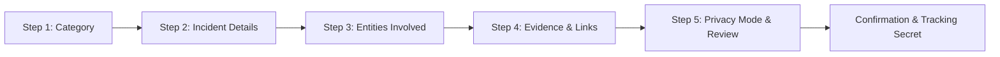

# PRODUCT SPECIFICATION

---

## 1. Product Identity & Purpose

The **Bangladesh Civic Reporting Platform** is a professional civic-technology service designed to document allegations of abuse, corruption, law enforcement misconduct, violence, and institutional violations in Bangladesh.

### Core Mantras
- **Not Social Media:** No public comment sections, gossip boards, or algorithmic amplification.
- **Allegation by Default:** Every submission is strictly a citizen allegation until verified via our published methodology.
- **Civic Action over Outrage:** Designed to assist victims in obtaining legal, institutional, or protective intervention.

---

## 2. User Roles & Capabilities Matrix

| Feature / Action | Public Visitor | Reporter (Anon/Conf) | Reviewer | Senior Reviewer | Administrator |
| :--- | :---: | :---: | :---: | :---: | :---: |
| View Public Reports & Stats | Yes | Yes | Yes | Yes | Yes |
| Explore National Maps | Yes | Yes | Yes | Yes | Yes |
| Access Emergency Hotlines | Yes | Yes | Yes | Yes | Yes |
| Submit New Incident Report | Yes | Yes | Yes | Yes | Yes |
| Track Report via Secret Code | No | Yes (Own report) | N/A | N/A | N/A |
| Two-Way Message Case Moderator | No | Yes (Own report) | Yes | Yes | Yes |
| Review Raw/Private Evidence | No | Yes (Own report) | Yes | Yes | Yes |
| Add Internal Review Notes | No | No | Yes | Yes | Yes |
| Transition Report Status | No | No | Limited | Full | Full |
| Approve Public Disclosure | No | No | No | Yes | Yes |
| Mark Allegation as Verified | No | No | No | Yes | Yes |
| Manage User Roles & Accounts | No | No | No | No | Yes |
| View System Audit Logs | No | No | No | No | Yes |

---

## 3. Incident Taxonomy & Categories

The taxonomy is stored dynamically in the PostgreSQL database under `report_categories`. The initial canonical categories are:

### 1. Abuse & Harassment (`abuse_harassment`)
- Physical Abuse
- Verbal & Psychological Abuse
- Sexual Harassment / Eve-teasing
- Bullying & Intimidation
- Campus Ragging
- Stalking & Threat of Blackmail

### 2. Corruption & Extortion (`corruption`)
- Bribery Demands (সরকারি ঘুষ দাবি)
- Extortion / Chanda (চাঁদাবাজি)
- Procurement & Tender Fraud
- Embezzlement & Financial Misconduct
- Abuse of Official Discretion

### 3. Violence & Threat (`violence`)
- Physical Assault
- Death Threats & Armed Coercion
- Gang & Mob Violence
- Institutional Violence

### 4. Police & Law Enforcement Misconduct (`police`)
- Extortion / Arbitrary Bribery
- Unlawful Detention & Harassment
- Excessive Force & Custodial Violence
- Refusal to Register First Information Report (FIR / GD)
- Abuse of Regulatory Powers

### 5. Education & Academia (`education`)
- Ragging & Dormitory Violence
- Academic Blackmail & Grade Manipulation
- Extortionate & Unauthorized Fees
- Teacher/Faculty Misconduct
- Institutional Inaction on Student Safety

### 6. Workplace & Labor (`workplace`)
- Sexual Harassment at Workplace
- Unlawful Termination & Wage Theft
- Hazardous / Unsafe Working Conditions
- Discriminatory Practices

### 7. Government & Public Services (`government`)
- Harassment at Land / Passport / NID Offices
- Administrative Negligence & Delayed Services
- Corrupt Intermediaries (Dalal / দালাল)
- Misuse of Public Assets

### 8. Public Space & Infrastructure (`public_space`)
- Harassment on Public Transport & Bus Terminals
- Illegal Encroachment of Public Footpaths / Roads
- Road Extortion & Vehicle Harassment
- Public Safety Hazards

### 9. Online & Cyber Crime (`online`)
- Cyber Harassment & Defamation
- Non-Consensual Image Sharing (NCII)
- Online Financial Scams & Identity Theft
- Coercion & Digital Blackmail

### 10. Other Public Interest (`other`)
- Controlled custom classification with mandatory explanation.

---

## 4. Multi-Step Reporting Wizard Workflow

The reporting flow is implemented across 5 discrete, accessible steps:

### Step 1: Incident Category Selection
- Large, high-contrast, bilingual category cards with descriptive icons.
- Sub-category selection filtered dynamically.

### Step 2: Incident Details
- **Date & Approximate Time:** Datepicker with relative options ("Last 24 hours", "This week", "Within last month", "Specific date").
- **Geographic Granularity:**
  - Division (Dropdown: 8 Divisions)
  - District (Dropdown: 64 Districts filtered by Division)
  - Upazila / Thana (Dropdown or controlled autocomplete)
  - Specific Area / Landmark (Optional; flagged with safety warning)
- **Location Privacy Level:**
  - `EXACT` (For public misconduct in open areas)
  - `APPROXIMATE` (Only district/city shown publicly)
  - `CONFIDENTIAL` (Stored for reviewer use only; never revealed publicly)
- **Description:** Rich textarea with guided prompts (What occurred, how it started, who was impacted).

### Step 3: Involved Parties & Institutions
- **Organization Type:** (University, Police Thana, Government Office, Private Company, Hospital, NGO, etc.)
- **Organization Name:** Autocomplete or free text.
- **Specific Roles / Titles Involved:** (e.g., "Duty Officer", "Office Assistant", "Senior Student").
- *Notice:* Warning banner: "Do NOT share unverified private addresses or sensitive phone numbers unless essential for case investigation."

### Step 4: Evidence Submission
- **File Upload Area:** Supports Drag-and-Drop for Images, Documents, Audio, and Video files.
- **External Evidence Integrations (First-Class):**
  - Instant URL paste input.
  - Auto-detection of provider: **YouTube**, **Facebook**, **Google Drive**, **Google Photos**, **Dropbox**, or **General News / Web Link**.
  - Review status indicators.

### Step 5: Privacy Selection & Final Review
- **Choice of Privacy Mode:**
  1. **Anonymous:** Complete identity shield. No personal records stored.
  2. **Confidential:** Contact email/phone stored encrypted, accessible only to Senior Reviewers to request clarification.
  3. **Identified:** Reporter provides full consent for verified attribution.
- Clear, plain-language consent agreement.
- Generation of the public Case ID (`BD-2026-XXXXXX`) and the high-entropy tracking passkey.

---

## 5. Report Tracking System (`/track`)

Upon successful submission, the reporter is directed to `/track` where they can query their report status:
- **Authentication:** `Report ID` (e.g., `BD-2026-001241`) + `Tracking Secret` (16-character alphanumeric key).
- **Displayed Data:**
  - Current status with interactive visual timeline.
  - Verification checklist status.
  - Secure two-way reviewer messaging pane.
  - Requests for additional evidence.
  - Referral notice (e.g., "Case referred to Bangladesh National Human Rights Commission").
- **Strict Data Segregation:** Internal moderator notes and other private cases are completely inaccessible.

---

## 6. Public Portal & Pages

1. **Homepage (`/`):**
   - High-impact civic hero banner.
   - Live verified incident counter (Reports received vs Verified).
   - "Report an Incident" prominent call to action.
   - Bangladesh Division aggregation map.
   - Emergency resource shortcuts.
   - Transparent methodology teaser.
2. **Public Reports Catalog (`/reports`):**
   - Multi-facet search (Keyword, Category, Division, District, Status, Date).
   - Card view with neutral allegation badges.
3. **Public Case Detail (`/reports/[id]`):**
   - Verified summary, public evidence gallery, and official organizational responses.
4. **Geographic Map (`/map`):**
   - Division and District choropleth visualizer.
5. **Accountability Dashboard (`/dashboard`):**
   - Resolution rates, monthly intake volume, category distributions.
6. **Support Resources (`/resources`):**
   - Verified hotlines (999, 109, 333, Legal Aid, Ain o Salish Kendra, BLAST, etc.).
7. **Methodology & Safety (`/methodology`, `/safety`):**
   - Detailed evidentiary standards and personal safety advice.
