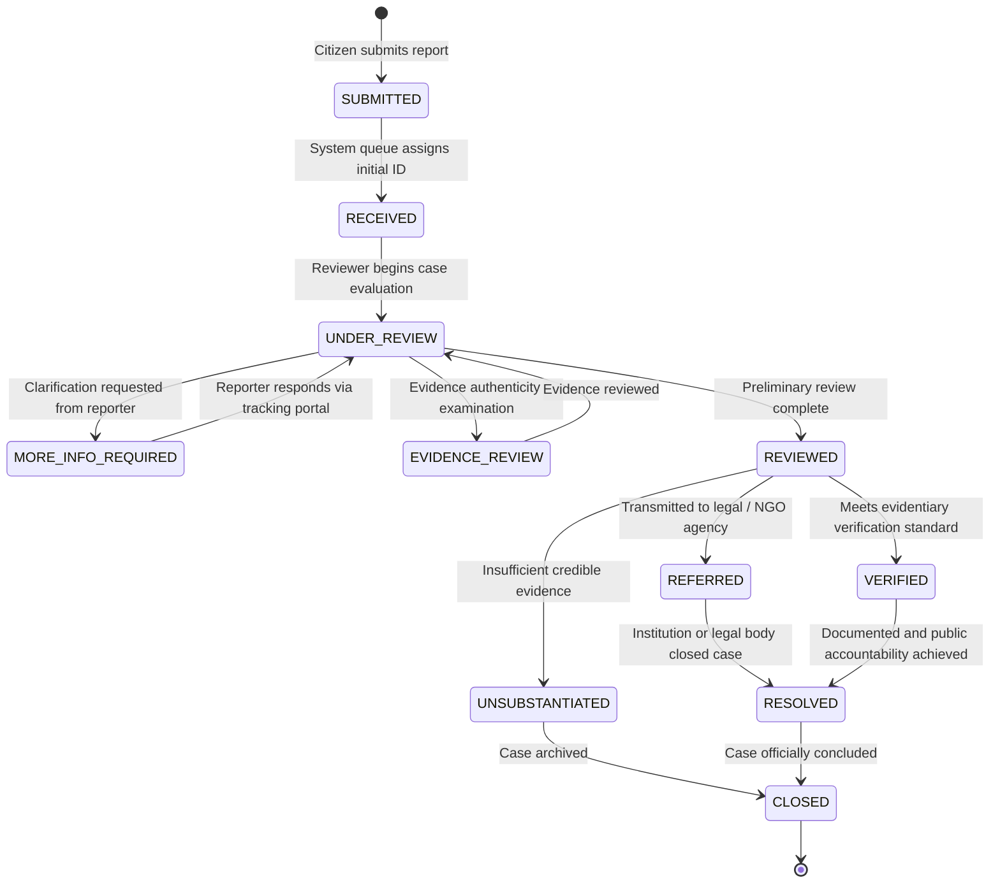

# REPORT WORKFLOW & STATUS STATE MACHINE

---

## 1. Centralized Status State Machine

To prevent arbitrary status assignments, case lifecycles strictly follow a validated state machine. Every transition creates an immutable record in `report_status_history`.



---

## 2. Allowed Transition Matrix

| Current State | Allowed Next States | Permitted Roles | Notes / Trigger Conditions |
| :--- | :--- | :--- | :--- |
| `SUBMITTED` | `RECEIVED` | System, Reviewer | Automatic upon intake or manual reviewer confirmation. |
| `RECEIVED` | `UNDER_REVIEW` | Reviewer, Sr. Reviewer, Admin | When a reviewer assigns themselves to the case. |
| `UNDER_REVIEW` | `MORE_INFO_REQUIRED`, `EVIDENCE_REVIEW`, `REVIEWED`, `UNSUBSTANTIATED` | Reviewer, Sr. Reviewer, Admin | Requires explanatory internal note. |
| `MORE_INFO_REQUIRED` | `UNDER_REVIEW`, `CLOSED` | Reporter (via response), Reviewer | Reviewer can close if no response after 30 days. |
| `EVIDENCE_REVIEW` | `UNDER_REVIEW`, `REVIEWED` | Reviewer, Sr. Reviewer, Admin | After inspecting direct uploads & external links. |
| `REVIEWED` | `REFERRED`, `VERIFIED`, `UNSUBSTANTIATED` | Senior Reviewer, Admin | Verification requires Senior Reviewer sign-off. |
| `REFERRED` | `RESOLVED`, `CLOSED` | Reviewer, Sr. Reviewer, Admin | Based on agency updates. |
| `VERIFIED` | `RESOLVED`, `CLOSED` | Senior Reviewer, Admin | Approved for public case catalog. |
| `UNSUBSTANTIATED`| `CLOSED`, `UNDER_REVIEW` | Senior Reviewer, Admin | Can reopen if fresh evidence is provided. |
| `RESOLVED` | `CLOSED` | Senior Reviewer, Admin | Formal archival. |
| `CLOSED` | `UNDER_REVIEW` | Admin only | Exceptional reopening upon formal appeal. |

---

## 3. Bilingual Status Mapping & Public Labels

To uphold legal and ethical standards, status names use clear, neutral language in both languages:

| Technical State | English Label (Public / UI) | Bengali Label (বাংলা) | UI Badge Variant |
| :--- | :--- | :--- | :--- |
| `submitted` | Submitted | দাখিল করা হয়েছে | `default` (slate) |
| `received` | Received | গৃহীত হয়েছে | `info` (blue) |
| `under_review` | Under Review | পর্যালোচনাধীন | `warning` (amber) |
| `more_info_required` | Information Requested | অতিরিক্ত তথ্য প্রয়োজন | `warning` (amber) |
| `evidence_review` | Evidence Under Review | প্রমাণ পর্যালোচনাধীন | `purple` |
| `reviewed` | Review Completed | প্রাথমিক পর্যালোচনা সম্পন্ন | `blue` |
| `referred` | Referred to Agency | সংস্থায় প্রেরিত | `indigo` |
| `verified` | Verified Allegation | যাচাইকৃত প্রতিবেদন | `success` (emerald) |
| `unsubstantiated`| Unsubstantiated | অপ্রমাণিত / অপর্যাপ্ত প্রমাণ | `secondary` (gray) |
| `resolved` | Resolved | নিষ্পত্তি হয়েছে | `success` (emerald) |
| `closed` | Closed | সমাপ্ত | `outline` |

---

## 4. Status History Schema & Trigger Mechanism

Every transition must log:
- `previous_status`
- `new_status`
- `actor_id` (Staff UUID, or NULL if triggered by citizen response)
- `public_note` (Visible to citizen on tracking page)
- `internal_rationale` (Visible strictly to reviewers in admin panel)

```sql
CREATE OR REPLACE FUNCTION log_report_status_transition()
RETURNS TRIGGER AS $$
BEGIN
    IF (OLD.status IS DISTINCT FROM NEW.status) THEN
        INSERT INTO report_status_history (
            report_id,
            previous_status,
            new_status,
            actor_id,
            created_at
        ) VALUES (
            NEW.id,
            OLD.status,
            NEW.status,
            auth.uid(),
            now()
        );
    END IF;
    RETURN NEW;
END;
$$ LANGUAGE plpgsql SECURITY DEFINER;
```
