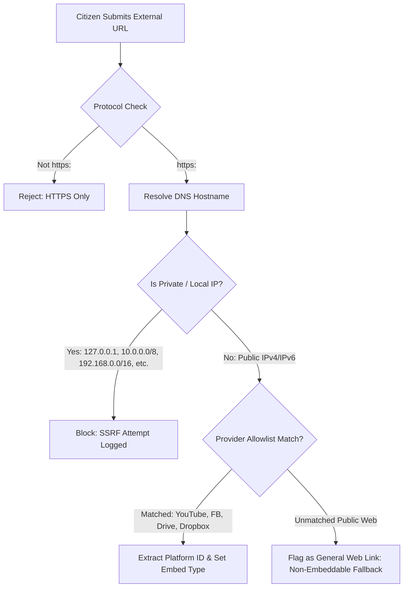

# SECURITY & THREAT MITIGATION SPECIFICATION

---

## 1. Threat Modeling in the Bangladesh Civic Context

Operating an abuse and misconduct reporting platform in Bangladesh entails high-stakes physical, digital, and legal threats:

| Threat Actor | Threat Vector | Mitigation Strategy |
| :--- | :--- | :--- |
| **Accused Perpetrators / Influential Figures** | DoS/DDoS attacks, credential stuffing, legal threats regarding defamation, physical retaliation against reporters. | Cloudflare WAF, strict anonymity defaults, public reports labeled solely as unverified allegations, zero personally identifiable information (PII) published. |
| **Malicious Citizens / Trolls** | Bad-faith false reports, fabricated evidence, smear campaigns against rivals or institutions. | Mandatory human moderation, strict evidence review states, no automated public indexing, clear audit logs. |
| **State Surveillance / Interception** | ISP traffic sniffing, DNS interception, seizing of database records. | Mandatory TLS 1.3/HSTS, zero IP storage for anonymous reports, cryptographic hashing of tracking keys, encrypted contact storage. |
| **Attackers Targeting Infrastructure** | Server-Side Request Forgery (SSRF) via external evidence links, arbitrary file uploads (RCE), SQL injection. | SSRF URL filtering with IP range denylists, file magic byte inspection, parameterized SQL queries via Supabase client. |

---

## 2. Reporter Anonymity & Data Minimization

### 2.1 Anonymity vs Confidentiality vs Identified
- **Anonymous Mode:**
  - Database stores `NULL` for reporter name, email, phone, and user ID.
  - Web server drops `x-forwarded-for` and `remote-addr` headers before database insertion.
  - No session cookies are set for reporting.
  - Tracking relies solely on the generated key pair (`BD-2026-XXXXXX` + random 16-char secret).
- **Confidential Mode:**
  - Name and contact are encrypted at rest using AES-256-GCM before being stored in `reporter_contacts`.
  - Accessible strictly to Senior Reviewers and Admins for legitimate investigation updates.
  - Never exposed in public endpoints or standard reviewer views.
- **Identified Mode:**
  - Name and contact are verified and can be disclosed in referral filings with explicit user consent.

### 2.2 Metadata & EXIF Scrubbing
When images (JPEG, PNG, WebP) are uploaded, GPS coordinates, camera serial numbers, and device timestamps are scrubbed before storage write.
```typescript
// Sanitization Pipeline Overview
async function sanitizeUploadedFile(buffer: Buffer, mimeType: string): Promise<Buffer> {
  if (mimeType.startsWith('image/')) {
    // Strips EXIF, XMP, IPTC headers while preserving pixel data
    return await sharp(buffer).rotate().toBuffer();
  }
  return buffer;
}
```

---

## 3. File Upload Security

1. **Extension Spoofing Prevention:**
   File extensions provided by the client are discarded. The server inspects the first 512 bytes (magic numbers) using `file-type` to detect the true MIME type.
2. **Strict MIME Allowlist:**
   - Images: `image/jpeg`, `image/png`, `image/webp`
   - Documents: `application/pdf`
   - Audio: `audio/mpeg`, `audio/wav`, `audio/ogg`
   - Video: `video/mp4`, `video/webm`
   - Executables (`.exe`, `.sh`, `.bat`, `.js`, `.php`, `.py`) are strictly rejected.
3. **Storage Isolation:**
   Uploaded files are stored in a private object storage bucket with randomly generated UUID keys:
   `cases/{report_id}/{uuid_v4}.{sanitized_ext}`
   Direct public URL access is prohibited. All views require an ephemeral pre-signed URL (15-minute expiration) generated by an authorized API route.
4. **Configurable Size Limits:**
   - Images: 10 MB
   - Documents: 20 MB
   - Audio: 30 MB
   - Video: 100 MB
   - Maximum 10 evidence items per case.

---

## 4. External URL & SSRF Defense Architecture

Because external evidence (YouTube, Facebook, Google Drive, Google Photos, Dropbox) is a core feature, external URL intake must be rigorously protected against Server-Side Request Forgery (SSRF) and malicious redirects.



### SSRF Denylist Ranges:
- `0.0.0.0/8`
- `10.0.0.0/8`
- `100.64.0.0/10`
- `127.0.0.0/8`
- `169.254.0.0/16` (Cloud metadata endpoint `169.254.169.254`)
- `172.16.0.0/12`
- `192.168.0.0/16`
- `::1/128`, `fc00::/7`, `fe80::/10`

---

## 5. Secret Tracking Key Security & Threat Model

1. **High Entropy:** Tracking passkeys are machine-generated using cryptographically secure pseudo-random number generators (`crypto.randomBytes(12)` mapped to 16 alphanumeric characters in four 4-character hyphenated blocks, excluding ambiguous characters `0, 1, l, o`). This guarantees ~80 bits of true cryptographic entropy ($32^{16} \approx 1.2 \times 10^{24}$ possibilities).
2. **Threat Model & Cryptographic Verification:**
   - Because the tracking passkey is a high-entropy CSPRNG machine token rather than a low-entropy human password, it is not susceptible to dictionary attacks.
   - The platform stores the SHA-256 cryptographic digest (`tracking_secret_hash`) in the database.
   - Verification uses timing-safe constant-time buffer comparison (`crypto.timingSafeEqual`) to prevent side-channel timing leaks.
   - SHA-256 prevents serverless CPU exhaustion during traffic spikes while providing 256-bit collision and pre-image resistance.
3. **Lookup Rate Limiting & Zero Leakage:**
   - Tracking queries are strictly rate-limited using distributed counters (`report-track` tier: max 15 requests per 15 minutes per IP address).
   - In production, missing database connectivity fails closed (no fallback to mock storage).
   - The API tracking endpoint projects strict allow-lists and never returns `tracking_secret_hash`, reviewer assignments, contact details, or internal review rationale.

---

## 6. Security Headers & Defense in Depth

The application enforces strict HTTP headers in production:

```http
Content-Security-Policy: default-src 'self'; script-src 'self' 'unsafe-inline'; style-src 'self' 'unsafe-inline'; img-src 'self' data: https:; frame-src https://www.youtube.com https://www.facebook.com; connect-src 'self' https://*.supabase.co; object-src 'none'; base-uri 'self';
Strict-Transport-Security: max-age=63072000; includeSubDomains; preload
X-Content-Type-Options: nosniff
X-Frame-Options: SAMEORIGIN
Referrer-Policy: strict-origin-when-cross-origin
Permissions-Policy: camera=(), microphone=(), geolocation=()
```

---

## 7. Defense Against Coordinated Attacks

Jababdihi assumes hostile state or non-state actors will attempt to disrupt operations:

```text
INTERNET
   │
   ▼
┌──────────────────┐
│ Vercel CDN / WAF │   DDoS mitigation, IP rate-limiting, Bot protection
└────────┬─────────┘
   │
   ▼
┌──────────────────┐
│ Next.js App /    │   Application rate limiting, Zod schema validation,
│ Edge Cache       │   SSRF allowlisting, Safe Mode enforcement
└────────┬─────────┘
   │
   ▼
┌──────────────────┐
│ Supabase DB &    │   PostgreSQL Row-Level Security (RLS), multi-bucket storage
│ Storage Vault    │   isolation, immutable audit triggers, MFA admin access
└──────────────────┘
```

1. **DDoS & Scraping Floods:**
   - Mitigated via Vercel WAF edge filtering and Next.js edge caching (`s-maxage=60, stale-while-revalidate=120`).
   - Public queries strictly enforce maximum page bounds (`limit <= 50`) and non-sequential IDs (`BD-YYYY-NNNNNN`).
2. **Spam & Bot Floods:**
   - Multi-tier sliding window rate limits.
   - Bot challenge integration capability for suspicious traffic spikes.
3. **Privileged Credential Compromise:**
   - Never expose Supabase service-role keys to client JavaScript or browser contexts.
   - Enforce Multi-Factor Authentication (MFA) on all Reviewer and Admin accounts.
   - Granular RBAC (`reviewer`, `senior_reviewer`, `admin`, `super_admin`).

---

## 8. Multi-Tier Application Rate Limiting

Configured in `src/lib/security/rate-limit.ts`:

| Action Tier | Threshold | Sliding Window | Target Purpose |
| :--- | :--- | :--- | :--- |
| **`report-submit`** | 5 submissions | 1 hour / IP | Prevents automated flood spamming |
| **`report-track`** | 15 queries | 15 minutes / IP | Thwarts brute-force guessing of tracking secrets |
| **`evidence-upload`** | 10 tickets | 1 hour / IP | Prevents storage exhaustion and ticket flooding |
| **`case-messages`** | 20 messages | 1 hour / IP | Protects case reviewers from chat spam |
| **`public-api`** | 60 requests | 1 minute / IP | Thwarts aggressive public scraping |

---

## 9. Emergency Defensive Safe Mode Engine

Implemented in `src/lib/security/safe-mode.ts` and managed via `/admin`:

- **Purpose:** Enables rapid operational degradation under active attack without taking public accountability offline.
- **Capabilities in Safe Mode:**
  1. Temporarily restricts anonymous submissions while preserving confidential/identified reporting.
  2. Enforces CAPTCHA / proof-of-work challenges.
  3. Pauses direct file uploads to protect storage quotas while allowing external YouTube/Drive links.
  4. Heightens rate limits by 4x.
  5. Serves aggressively cached public report listings.
  6. Keeps public tracking portal 100% operational for existing cases.

---

## 10. Multi-Bucket Storage Isolation

Three segregated Supabase Storage buckets:

1. **`report-evidence-private`:**
   - **Access:** Strictly private. No public URL generation.
   - **Access Mechanism:** Short-lived signed download URLs (900s TTL) issued strictly to authenticated reviewers or verified reporters.
2. **`report-evidence-public`:**
   - **Access:** Public read for reviewed and approved evidentiary items.
   - **Modification:** Restricted to Senior Reviewers via RLS.
3. **`report-thumbnails`:**
   - **Access:** Public read for optimized, resized visual badges.

---

## 11. Mobile Resilience & Offline Draft Protocol

- **Lighthouse Targets:** Mobile Performance ≥90, Desktop ≥95.
- **Core Web Vitals:** FCP < 1.5s, LCP < 2.5s, INP < 200ms, CLS < 0.1.
- **Click-to-Play Video Facade:** YouTube iframes are not mounted until the user taps the poster thumbnail, saving ~1MB of JS per card.
- **Local Safe Draft:** Unsubmitted report drafts are preserved locally in browser `localStorage` (`jababdihi_report_draft_v1`), protecting citizens from losing information during network dropouts. Drafts are automatically purged upon successful submission.

