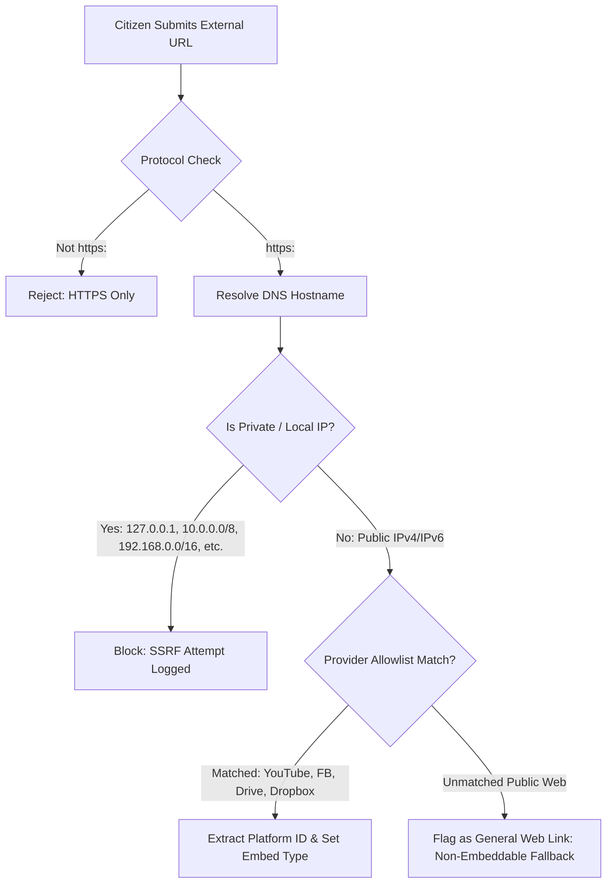

# SECURITY & THREAT MITIGATION SPECIFICATION

---

## 1. Threat Modeling in the Bangladesh Civic Context

Operating an abuse and misconduct reporting platform in Bangladesh entails high-stakes physical, digital, and legal threats:

| Threat Actor | Threat Vector | Mitigation Strategy |
| :--- | :--- | :--- |
| **Accused Perpetrators / Influential Figures** | DoS/DDoS attacks, credential stuffing, legal threats regarding defamation, physical retaliation against reporters. | Cloudflare WAF, strict anonymity defaults, public reports labeled solely as unverified allegations, zero personally identifiable information (PII) published. |
| **Malicious Citizens / Trolls** | Bad-faith false reports, fabricated evidence, smear campaigns against rivals or institutions. | Mandatory human moderation, strict evidence review states, no automated public indexing, clear audit logs. |
| **State Surveillance / Interception** | ISP traffic sniffing, DNS interception, seizing of database records. | Mandatory TLS 1.3/HSTS, zero IP storage for anonymous reports, cryptographic hashing of tracking keys, encrypted contact storage. |
| **Attackers Targeting Infrastructure** | Server-Side Request Forgery (SSRF) via external evidence links, arbitrary file uploads (RCE), SQL injection. | SSRF URL filtering with IP range denylists, file magic byte inspection, parameterized SQL queries via Supabase client. |

---

## 2. Reporter Anonymity & Data Minimization

### 2.1 Anonymity vs Confidentiality vs Identified
- **Anonymous Mode:**
  - Database stores `NULL` for reporter name, email, phone, and user ID.
  - Web server drops `x-forwarded-for` and `remote-addr` headers before database insertion.
  - No session cookies are set for reporting.
  - Tracking relies solely on the generated key pair (`BD-2026-XXXXXX` + random 16-char secret).
- **Confidential Mode:**
  - Name and contact are encrypted at rest using AES-256-GCM before being stored in `reporter_contacts`.
  - Accessible strictly to Senior Reviewers and Admins for legitimate investigation updates.
  - Never exposed in public endpoints or standard reviewer views.
- **Identified Mode:**
  - Name and contact are verified and can be disclosed in referral filings with explicit user consent.

### 2.2 Metadata & EXIF Scrubbing
When images (JPEG, PNG, WebP) are uploaded, GPS coordinates, camera serial numbers, and device timestamps are scrubbed before storage write.
```typescript
// Sanitization Pipeline Overview
async function sanitizeUploadedFile(buffer: Buffer, mimeType: string): Promise<Buffer> {
  if (mimeType.startsWith('image/')) {
    // Strips EXIF, XMP, IPTC headers while preserving pixel data
    return await sharp(buffer).rotate().toBuffer();
  }
  return buffer;
}
```

---

## 3. File Upload Security

1. **Extension Spoofing Prevention:**
   File extensions provided by the client are discarded. The server inspects the first 512 bytes (magic numbers) using `file-type` to detect the true MIME type.
2. **Strict MIME Allowlist:**
   - Images: `image/jpeg`, `image/png`, `image/webp`
   - Documents: `application/pdf`
   - Audio: `audio/mpeg`, `audio/wav`, `audio/ogg`
   - Video: `video/mp4`, `video/webm`
   - Executables (`.exe`, `.sh`, `.bat`, `.js`, `.php`, `.py`) are strictly rejected.
3. **Storage Isolation:**
   Uploaded files are stored in a private object storage bucket with randomly generated UUID keys:
   `cases/{report_id}/{uuid_v4}.{sanitized_ext}`
   Direct public URL access is prohibited. All views require an ephemeral pre-signed URL (15-minute expiration) generated by an authorized API route.
4. **Configurable Size Limits:**
   - Images: 10 MB
   - Documents: 20 MB
   - Audio: 30 MB
   - Video: 100 MB
   - Maximum 10 evidence items per case.

---

## 4. External URL & SSRF Defense Architecture

Because external evidence (YouTube, Facebook, Google Drive, Google Photos, Dropbox) is a core feature, external URL intake must be rigorously protected against Server-Side Request Forgery (SSRF) and malicious redirects.



### SSRF Denylist Ranges:
- `0.0.0.0/8`
- `10.0.0.0/8`
- `100.64.0.0/10`
- `127.0.0.0/8`
- `169.254.0.0/16` (Cloud metadata endpoint `169.254.169.254`)
- `172.16.0.0/12`
- `192.168.0.0/16`
- `::1/128`, `fc00::/7`, `fe80::/10`

---

## 5. Secret Tracking Key Security

1. **Entropy:** Tracking keys are generated using cryptographically secure pseudo-random number generators (`crypto.randomBytes(12)` formatted as `xxxx-xxxx-xxxx-xxxx`).
2. **Storage:** The database stores only the salted cryptographic hash (`Argon2id` or `Bcrypt`) of the tracking key. Even with full database access, attackers cannot reverse the keys to query report tracking panels.
3. **Lookup Rate Limiting:** Tracking queries are limited to **5 attempts per 15 minutes** per IP address. Exceeding this triggers a temporary block to prevent brute-force attacks on report identifiers.

---

## 6. Security Headers & Defense in Depth

The application enforces strict HTTP headers in production:

```http
Content-Security-Policy: default-src 'self'; script-src 'self' 'unsafe-inline'; style-src 'self' 'unsafe-inline'; img-src 'self' data: https:; frame-src https://www.youtube.com https://www.facebook.com; connect-src 'self' https://*.supabase.co; object-src 'none'; base-uri 'self';
Strict-Transport-Security: max-age=63072000; includeSubDomains; preload
X-Content-Type-Options: nosniff
X-Frame-Options: SAMEORIGIN
Referrer-Policy: strict-origin-when-cross-origin
Permissions-Policy: camera=(), microphone=(), geolocation=()
```
