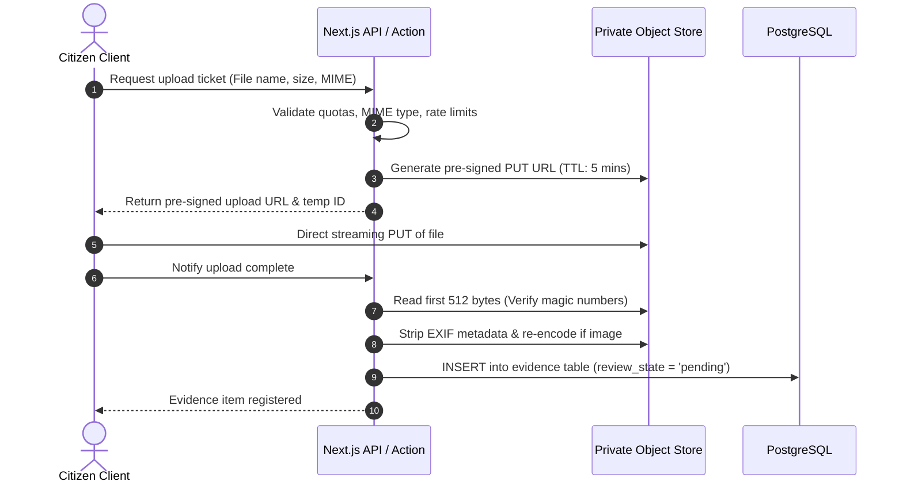

# STORAGE ARCHITECTURE & ASSET MANAGEMENT

---

## 1. Storage Overview

The storage system handles direct evidence uploads without exposing persistent public URLs or compromising file security.

### Core Tenets:
- **Zero Public Buckets for Evidence:** All submitted files reside in private object storage (`evidence-vault`).
- **Pre-Signed Ephemeral Access:** Access is granted solely through cryptographic pre-signed URLs with a 15-minute Time-To-Live (TTL).
- **Automated EXIF Scrubbing:** Stripping of camera serials, timestamps, and GPS coordinates prior to final storage.
- **Configurable Storage Quotas:** Configurable limits enforced server-side.

### 1.1 Direct Uploads vs External Evidence Separation

#### External Evidence (YouTube, Facebook, Google Drive, Dropbox):
```text
YouTube video
      ↓
Store URL in Supabase
      ↓
Embed on Jababdihi
      ↓
YouTube serves video
```
External media links do not consume Supabase Storage bandwidth or bucket storage.

#### Uploaded Evidence:
```text
User
 ↓
Jababdihi
 ↓
Supabase Storage (evidence-vault private bucket)
 ↓
Reviewer
 ↓
Public only if approved
```

---

## 2. Storage Buckets & Policies

| Bucket Name | Access Model | Max Object Size | Allowed MIME Types | Purpose |
| :--- | :--- | :--- | :--- | :--- |
| `evidence-vault` | Strictly Private | 100 MB | JPEG, PNG, WebP, PDF, MP3, WAV, MP4, WebM | User-submitted files (Images, docs, audio, video) |
| `evidence-thumbnails` | Private (Pre-signed) | 2 MB | WebP | Generated blur previews and thumbnails |
| `system-assets` | Public Read | 5 MB | SVG, PNG, WebP | Official organization logos, category icons, guides |

---

## 3. Configurable Upload Limits

The limits are controlled dynamically via environment variables and database configuration:

```typescript
// src/config/storage.config.ts
export const STORAGE_LIMITS = {
  MAX_FILES_PER_REPORT: 10,
  MAX_SIZES: {
    IMAGE: 10 * 1024 * 1024,      // 10 MB
    DOCUMENT: 20 * 1024 * 1024,   // 20 MB
    AUDIO: 30 * 1024 * 1024,      // 30 MB
    VIDEO: 100 * 1024 * 1024,     // 100 MB
  },
  ALLOWED_EXTENSIONS: {
    IMAGE: ['.jpg', '.jpeg', '.png', '.webp'],
    DOCUMENT: ['.pdf'],
    AUDIO: ['.mp3', '.wav', '.ogg'],
    VIDEO: ['.mp4', '.webm'],
  }
};
```

---

## 4. Secure Upload Lifecycle



---

## 5. File Viewing & Download Strategy

1. **Reviewer Portal:**
   When a reviewer opens a report, the server generates pre-signed GET URLs with a 15-minute expiry for each attached file.
2. **Public Reports:**
   For public reports, only evidence explicitly approved (`visibility = 'public'`) is viewable. Pre-signed URLs are proxied through an edge cache or short-lived token to prevent scraping and link leeching.
